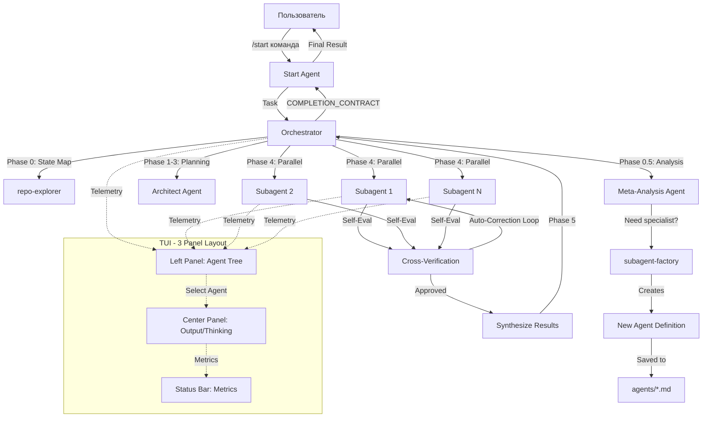

# Архитектура автономной мульти-агентной системы Hercules Agent

## Содержание
1. [System Architecture Diagram](#1-system-architecture-diagram)
2. [Component Breakdown](#2-component-breakdown)
3. [Data Models](#3-data-models)
4. [Execution Flow](#4-execution-flow)
5. [UI Layout Specification](#5-ui-layout-specification)
6. [Rollup Algorithm](#6-rollup-algorithm)
7. [Meta-Agent Factory](#7-meta-agent-factory)
8. [Optimization Strategies](#8-optimization-strategies)
9. [Self-Evaluation Loop](#9-self-evaluation-loop)

---

## 1. System Architecture Diagram



---

## 2. Component Breakdown

### Файлы для изменения:

| Файл | Изменения |
|------|-----------|
| `agent/subagent_tree.py` | Добавить агрегацию метрик, `get_rollup_metrics()`, обновить `render_subagent_tree()` |
| `agent/subagent_tree_panel.py` | Расширить `TreeNode` (telemetry, toggles), добавить `get_cumulative_metrics()`, реализовать "Show/Hide Output" |
| `tools/delegate_tool.py` | Добавить `tokens_in`, `tokens_out`, `cost_usd` в записи субагентов, реализовать `_calculate_cost()`, `_get_cumulative_metrics()` |
| `run_agent.py` (AIAgent) | Добавить сбор телеметрии, методы `self_evaluate()`, `cross_verify_with()`, `auto_correct()` |
| `ui-tui/src/components/agentsOverlay.tsx` | Переделать в 3-панельный макет, добавить toggles, статус-бар |
| `ui-tui/src/lib/subagentTree.ts` | Добавить интерфейсы TypeScript для телеметрии, функции расчёта rollup |

### Новые файлы для создания:

| Файл | Описание |
|------|-----------|
| `agent/self_evaluation.py` | Класс `SelfEvaluation` с методами оценки, верификации и автокоррекции |
| `agent/meta_analysis.py` | Класс `MetaAnalysisAgent` для анализа потребности в специализированных агентах |
| `agent/autonomy_engine.py` | Класс `AutonomyEngine` для вывода потребностей и самооптимизации |
| `ui-tui/src/components/statusBar.tsx` | Компонент статус-бара с агрегированными метриками |
| `ui-tui/src/hooks/useTelemetry.ts` | Hook для управления данными телеметрии и состоянием toggles |

---

## 3. Data Models

### Python (в `tools/delegate_tool.py` или новом `telemetry.py`)

```python
from dataclasses import dataclass
from typing import Optional, List, Dict, Any

@dataclass
class TelemetryRecord:
    """Телеметрия выполнения одного агента."""
    subagent_id: str
    agent_name: str
    parent_id: Optional[str]
    depth: int

    # Timing
    started_at: float
    completed_at: Optional[float] = None
    execution_time: float = 0.0

    # Tokens
    tokens_input: int = 0
    tokens_output: int = 0
    tokens_cache_read: int = 0
    tokens_cache_write: int = 0

    # Cost
    model: str = ""
    cost_usd: float = 0.0

    # Tool usage
    tool_count: int = 0
    tools_called: List[str] = None

    # Status
    status: str = "running"  # running, completed, failed, interrupted

    # Output controls (для UI)
    show_output: bool = True
    show_thinking: bool = True
    show_tool_calls: bool = True
    show_intermediate: bool = True

    # Self-evaluation
    self_evaluation_score: Optional[float] = None
    cross_verification_passed: Optional[bool] = None
    correction_iterations: int = 0

    def __post_init__(self):
        if self.tools_called is None:
            self.tools_called = []

    @property
    def total_tokens(self) -> int:
        return self.tokens_input + self.tokens_output + self.tokens_cache_read + self.tokens_cache_write

    @property
    def is_complete(self) -> bool:
        return self.status in ("completed", "failed", "interrupted")


@dataclass
class RollupMetrics:
    """Кумулятивные метрики для агента и всех его потомков."""
    agent_id: str
    agent_name: str

    # Direct metrics (только этот агент)
    direct_tokens_input: int = 0
    direct_tokens_output: int = 0
    direct_cost_usd: float = 0.0
    direct_tools: int = 0
    direct_execution_time: float = 0.0

    # Cumulative metrics (агент + все дети)
    total_tokens_input: int = 0
    total_tokens_output: int = 0
    total_cost_usd: float = 0.0
    total_tools: int = 0
    total_execution_time: float = 0.0

    # Children breakdown
    children_metrics: List['RollupMetrics'] = None

    def __post_init__(self):
        if self.children_metrics is None:
            self.children_metrics = []

    @property
    def total_tokens(self) -> int:
        return self.total_tokens_input + self.total_tokens_output

    def format_summary(self) -> str:
        """Формат: 'Agent A: 50 tokens, Subagent X: 30 tokens, Total: 80 tokens'"""
        parts = [f"{self.agent_name}: {self.direct_tokens_input + self.direct_tokens_output}t"]
        for child in self.children_metrics:
            parts.append(f"{child.agent_name}: {child.total_tokens}t")
        parts.append(f"Total: {self.total_tokens}t")
        return ", ".join(parts)

    def format_status_bar(self) -> str:
        """Формат: 'Total: 23 tools called · 102,176 tokens · $0.10'"""
        return f"Total: {self.total_tools} tools called · {self.total_tokens:,} tokens · ${self.total_cost_usd:.2f}"
```

### TypeScript (в `ui-tui/src/types/`)

```typescript
// telemetry.ts
export interface TelemetryData {
  subagentId: string;
  agentName: string;
  parentId: string | null;
  depth: number;

  // Timing
  startedAt: number;
  completedAt: number | null;
  executionTime: number;

  // Tokens
  tokensInput: number;
  tokensOutput: number;
  tokensCacheRead: number;
  tokensCacheWrite: number;

  // Cost
  model: string;
  costUsd: number;

  // Tools
  toolCount: number;
  toolsCalled: string[];

  // UI toggles
  showOutput: boolean;
  showThinking: boolean;
  showToolCalls: boolean;
  showIntermediate: boolean;
}

export interface RollupMetrics {
  agentId: string;
  agentName: string;

  directTokensInput: number;
  directTokensOutput: number;
  directCostUsd: number;
  directTools: number;

  totalTokensInput: number;
  totalTokensOutput: number;
  totalCostUsd: number;
  totalTools: number;
  totalExecutionTime: number;

  childrenMetrics: RollupMetrics[];
}
```

---

## 4. Execution Flow

### Последовательность событий при `/start`:

```
1. Пользователь вводит: /start <task_description>
   ↓
2. Start Agent активируется (agents/start.md)
   - Записывает ORIGINAL_REQUEST дословно
   - Определяет CONTINUOUS_MODE (single_wave | until_user_stop)
   - Устанавливает DEPTH_BUDGET на основе сложности
   ↓
3. Start Agent → Task(orchestrator, prompt={OBJECTIVE, ORIGINAL_REQUEST, ...})
   ↓
4. Orchestrator Agent (agents/orchestrator.md)
   ├─ Phase 0: State Map
   │   └─ Task(repo-explorer) → state_map
   │
   ├─ Phase 0.5: Specialist Analysis (ОБЯЗАТЕЛЬНО)
   │   └─ Task(specialist-analyzer) → analysis_result
   │       └─ Если нужен новый специалист: Task(subagent-factory) → создаёт агента
   │
   ├─ Phase 1: Execution Envelope
   │   └─ Создаёт: OBJECTIVE, NON-GOALS, CONSTRAINTS, AC, DELIVERABLES
   │
   ├─ Phase 2: Structural Check
   │   └─ Если веток > 6 → restructure
   │
   ├─ Phase 3: Decomposition
   │   └─ Создаёт N параллельных веток
   │
   ├─ Phase 4: Parallel Execution
   │   └─ ДЛЯ КАЖДОЙ ветки:
   │       ├─ Task(subagent_type, prompt=branch.contract)
   │       │   └─ Субагент выполняется со сбором телеметрии
   │       │       ├─ Собирает: execution_time, tokens_in, tokens_out, cost_usd
   │       │       ├─ Self-Evaluation: self_evaluate(output)
   │       │       ├─ ЕСЛИ оценка < порога: auto_correct(error, context)
   │       │       └─ Cross-Verification: verify_with_peer(output)
   │       │
   │       └─ Возвращает: COMPLETION_CONTRACT + evidence
   │
   └─ Phase 5: Synthesis
       └─ Агрегирует результаты, запускает верификацию
           └─ Возвращает: COMPLETION_CONTRACT родителю
   ↓
5. Start Agent получает результат Orchestrator
   ├─ Анализирует: статус (approval | pause | DEPTH_BUDGET exhausted)
   ├─ Если approval + single_wave: Synthesize → START_REPORT → Done
   ├─ Если approval + until_user_stop: Next wave
   ├─ Если pause (RELAY_REQUIRED): Proxy & continue
   └─ Если DEPTH_BUDGET исчерпан: Reset → New wave
   ↓
6. Self-Evaluation Loop (для каждого субагента):
   ├─ Агент завершает задачу
   ├─ Запуск self_evaluate(output) → score
   ├─ ЕСЛИ score < threshold:
   │   ├─ Запуск auto_correct(error, context)
   │   ├─ Повторное выполнение задачи
   │   └─ Повторная оценка
   ├─ Cross-verify с peer agent
   └─ ЕСЛИ верификация не пройдена: итерация цикла коррекции
   ↓
7. Финальный синтез в Start Agent
   ├─ delivery_ledger + claim_to_evidence
   └─ START_REPORT → Пользователю
```

---

## 5. UI Layout Specification

### Общий макет (Full-Screen TUI):

```
┌─────────────────────────────────────────────────────────────────────┐
│  Hercules Agent - Multi-Agent System                              │
├──────────────┬──────────────────────────────────┬────────────────┤
│              │                                  │                │
│  LEFT       │  CENTER PANEL                   │  RIGHT         │
│  PANEL      │  (Subagent Output)              │  PANEL         │
│  (Agent     │                                  │  (Thinking/    │
│  Tree)      │  [Show/Hide Toggles]            │  Tools/        │
│              │  ☑ Thinking  ☑ Tools  ☑ Interim │  Metrics)     │
│  ⊕ Start    │                                  │                │
│    ├─⊙ Orch │  Output for selected agent:      │  Tokens: 1,234 │
│    │  ├─⊙   │  ┌────────────────────────────┐ │  Cost: $0.05   │
│    │  └─⊙   │  │ Thinking trace...          │ │  Time: 12.3s   │
│    │          │  │                            │ │                │
│    └─⊙ Meta │  │ Tool calls...              │ │  [Rollup:      │
│               │  │                            │ │   Total: 5.6K  │
│ [Show/Hide]  │  │ Intermediate responses...  │ │   $0.15]      │
│  for each    │  └────────────────────────────┘ │                │
│  agent       │                                  │                │
├──────────────┴──────────────────────────────────┴────────────────┤
│ STATUS BAR: Total: 23 tools · 102,176 tokens · $0.10            │
└─────────────────────────────────────────────────────────────────────┘
```

### Left Panel (Agent Tree) - 25% ширины:

- **Header**: "⚕ Agents" с иконкой статуса (running/completed/failed count)
- **Tree Structure**: Иерархическое дерево с expand/collapse
  - Каждый узел показывает: иконку (статус), имя агента, (время, кол-во инструментов)
  - Пример: "⊙ Orchestrator (45s, 12t)"
- **Per-Agent Controls**:
  - Кнопка "Show Output" / "Hide Output" (toggle)
  - Expand/collapse children (▸/▾)
- **Selection**: Up/Down для навигации, Right/Enter для выбора, Left для возврата
- **Telemetry per node** (при выборе):
  - Direct: tokens in/out, cost
  - Cumulative: total tokens, total cost (включая детей)

### Center Panel (Subagent Output) - 50% ширины:

- **Header**: Имя выбранного агента + статус + модель
- **Toggle Buttons** (сверху):
  - ☑ Show Thinking (вкл/выкл)
  - ☑ Show Tool Calls (вкл/выкл)
  - ☑ Show Intermediate (вкл/выкл)
- **Output Area**:
  - Thinking traces (если включено и доступно)
  - Tool calls с превью (если включено)
  - Intermediate subagent responses (если включено и в parallel mode)
  - Final output/summary
- **Hints**: "Используйте кнопки выше для настройки вида. Выберите агента в левой панели."

### Right Panel (Thinking/Tools/Metrics) - 25% ширины:

- **Header**: "Details" или "Telemetry"
- **Token Usage**:
  - Input: X tokens
  - Output: Y tokens
  - Cache read: Z tokens
  - Total: X+Y+Z tokens
- **Cost Breakdown**:
  - Model: gpt-4o
  - Input cost: $X
  - Output cost: $Y
  - Total: $Z
- **Rollup Metrics** (для выбранного агента):
  - "Agent A: 50 tokens"
  - "Subagent X: 30 tokens"
  - "Total: 80 tokens"
- **Execution Time**: прошедшее время

### Status Bar (Bottom, полная ширина):

- **Format**: "Total: 23 tools called · 102,176 tokens · $0.10"
- **Live Updates**: Обновляется по мере завершения агентов
- **Color Coding**: Green (running), Gray (completed), Red (failed)

---

## 6. Rollup Algorithm

### Python Implementation (в `tools/delegate_tool.py`):

```python
def get_rollup_metrics(subagent_id: str) -> Optional[RollupMetrics]:
    """
    Рассчитать кумулятивные метрики для агента и всех его потомков.

    Возвращает RollupMetrics с:
    - direct_* : метрики только этого агента
    - total_* : метрики агента + всех детей (рекурсивно)
    """
    with _active_subagents_lock:
        # Получаем запись целевого агента
        target = _active_subagents.get(subagent_id)
        if not target:
            return None

        # Инициализация rollup
        rollup = RollupMetrics(
            agent_id=subagent_id,
            agent_name=target.get("agent_name", subagent_id),
        )

        # Добавляем прямые метрики (собственное использование агента)
        rollup.direct_tokens_input = target.get("tokens_in", 0)
        rollup.direct_tokens_output = target.get("tokens_out", 0)
        rollup.direct_cost_usd = target.get("cost_usd", 0.0)
        rollup.direct_tools = target.get("tool_count", 0)
        rollup.direct_execution_time = target.get("execution_time", 0.0)

        # Инициализируем total прямыми метриками
        rollup.total_tokens_input = rollup.direct_tokens_input
        rollup.total_tokens_output = rollup.direct_tokens_output
        rollup.total_cost_usd = rollup.direct_cost_usd
        rollup.total_tools = rollup.direct_tools
        rollup.total_execution_time = rollup.direct_execution_time

        # Рекурсивно добавляем rollup детей
        children = _get_children(subagent_id)
        for child in children:
            child_id = child.get("subagent_id")
            child_rollup = get_rollup_metrics(child_id)  # Рекурсивный вызов
            if child_rollup:
                rollup.total_tokens_input += child_rollup.total_tokens_input
                rollup.total_tokens_output += child_rollup.total_tokens_output
                rollup.total_cost_usd += child_rollup.total_cost_usd
                rollup.total_tools += child_rollup.total_tools
                rollup.total_execution_time += child_rollup.total_execution_time
                rollup.children_metrics.append(child_rollup)

        return rollup


def _get_children(parent_id: str) -> List[Dict[str, Any]]:
    """Получить всех прямых потомков родительского агента."""
    children = []
    for rec in _active_subagents.values():
        if rec.get("parent_id") == parent_id:
            children.append(rec)
    return children


def format_agent_rollup(rollup: RollupMetrics) -> str:
    """
    Формат: 'Agent A: 50 tokens, Subagent X: 30 tokens, Total: 80 tokens'
    """
    parts = [f"{rollup.agent_name}: {rollup.direct_tokens_input + rollup.direct_tokens_output}t"]
    for child in rollup.children_metrics:
        parts.append(f"{child.agent_name}: {child.total_tokens}t")
    parts.append(f"Total: {rollup.total_tokens_input + rollup.total_tokens_output}t")
    return ", ".join(parts)


def format_status_bar(rollup: RollupMetrics) -> str:
    """
    Формат: 'Total: 23 tools called · 102,176 tokens · $0.10'
    """
    total_tokens = rollup.total_tokens_input + rollup.total_tokens_output
    return f"Total: {rollup.total_tools} tools called · {total_tokens:,} tokens · ${rollup.total_cost_usd:.2f}"
```

### TypeScript Implementation (в `ui-tui/src/lib/subagentTree.ts`):

```typescript
export function calculateRollup(
  agentId: string,
  allAgents: Map<string, TelemetryData>
): RollupMetrics | null {
  const agent = allAgents.get(agentId);
  if (!agent) return null;

  // Прямые метрики
  const direct: RollupMetrics = {
    agentId: agent.subagentId,
    agentName: agent.agentName,
    directTokensInput: agent.tokensInput,
    directTokensOutput: agent.tokensOutput,
    directCostUsd: agent.costUsd,
    directTools: agent.toolCount,
    directExecutionTime: agent.executionTime,
    totalTokensInput: agent.tokensInput,
    totalTokensOutput: agent.tokensOutput,
    totalCostUsd: agent.costUsd,
    totalTools: agent.toolCount,
    totalExecutionTime: agent.executionTime,
    childrenMetrics: [],
  };

  // Получаем детей
  const children = Array.from(allAgents.values()).filter(
    (a) => a.parentId === agentId
  );

  for (const child of children) {
    const childRollup = calculateRollup(child.subagentId, allAgents);
    if (childRollup) {
      direct.totalTokensInput += childRollup.totalTokensInput;
      direct.totalTokensOutput += childRollup.totalTokensOutput;
      direct.totalCostUsd += childRollup.totalCostUsd;
      direct.totalTools += childRollup.totalTools;
      direct.totalExecutionTime += childRollup.totalExecutionTime;
      direct.childrenMetrics.push(childRollup);
    }
  }

  return direct;
}
```

---

## 7. Meta-Agent Factory

### Обзор:
Meta-Analysis субагент запускается после декомпозиции Orchestrator. Он анализирует, нужен ли специализированный агент для задачи. Если да, динамически создаёт спецификацию агента и регистрирует его.

### Workflow:

```
1. Meta-Analysis Agent (запускается Orchestrator после Phase 3)
   ↓
2. Analyze Task Requirements:
   - Сканировать описание задачи на ключевые слова предметной области
   - Проверить существующих агентов в директории `agents/`
   - Выявить пробелы: стек технологий, паттерны, домены
   ↓
3. Decision: Need Specialist?
   - YES → Создать нового агента
   - NO → Вернуть "none" в Orchestrator
   ↓ (YES path)
4. Create Agent Specification:
   - Прочитать `agents/subagent-factory.md` для шаблона
   - Сгенерировать `agent_md_content` (agents/<name>.md)
   - Сгенерировать `rules_mdc_content` (rules/<name>.mdc) если нужно
   - Сгенерировать `skill_md_content` (skills/<name>/SKILL.md) если переиспользуемо
   ↓
5. Register Agent:
   - Записать файлы в соответствующие директории
   - Обновить `agents/README.md`
   - Обновить `rules/specialists.mdc`
   - Зарегистрировать в реестре агентов (если поддерживается динамическая загрузка)
   ↓
6. Return to Orchestrator:
   - Новое имя агента: "<agent-name>"
   - Обоснование: "Почему этот агент был создан"
   - Next step: "Task(<agent-name>, goal='...')"
```

### Implementation (в `agent/meta_analysis.py`):

```python
class MetaAnalysisAgent:
    """Анализирует потребность в специализированных агентах и создаёт их."""

    def analyze_need(self, task_description: str, existing_agents: List[str]) -> Dict[str, Any]:
        """Определить, нужен ли специализированный агент."""
        prompt = f"""
        Task: {task_description}
        Existing agents: {existing_agents}

        Questions:
        1. Is there an existing agent that can handle this task?
        2. If not, what type of specialized agent is needed?
        3. What would be the agent's name (kebab-case)?
        4. What domain/technology does it cover?

        Return JSON: {{"need_agent": bool, "agent_name": str, "domain": str, "reason": str}}
        """
        # Вызвать LLM с prompt
        # Распарсить ответ
        return analysis_result

    def create_agent_specification(self, agent_name: str, domain: str, task_context: str) -> 'AgentSpecification':
        """Создать полную спецификацию агента."""
        spec = AgentSpecification(
            name=agent_name,
            display_name=agent_name.replace("-", " ").title(),
            description=f"Specialized agent for {domain}.",
            mission=f"Handle all tasks related to {domain}.",
            when_to_use=[f"When task involves {domain}", ...],
            scope_in=[f"{domain} related files", ...],
            scope_out=["Non-{domain} tasks"],
            workflow_steps=["Analyze", "Execute", "Verify"],
            quality_gates=["Output meets requirements"],
            handoff_format="COMPLETION_CONTRACT: ...",
            tools_required=self._infer_tools(domain),
            tools_optional=[],
        )

        # Генерировать agent.md content
        spec.agent_md_content = self._generate_agent_md(spec)
        spec.rules_mdc_content = self._generate_rules_mdc(spec)

        return spec

    def register_dynamic_agent(self, spec: 'AgentSpecification') -> bool:
        """Зарегистрировать нового агента записью файлов."""
        from pathlib import Path

        # Записать agent.md
        agent_path = Path("agents") / f"{spec.name}.md"
        agent_path.write_text(spec.agent_md_content)

        # Записать rules.mdc (опционально)
        if spec.rules_mdc_content:
            rules_path = Path("rules") / f"{spec.name}.mdc"
            rules_path.write_text(spec.rules_mdc_content)

        # Обновить agents/README.md
        self._update_readme(spec)

        # Обновить rules/specialists.mdc
        self._update_specialists_registry(spec)

        return True

    def _generate_agent_md(self, spec: 'AgentSpecification') -> str:
        """Сгенерировать содержимое agents/<name>.md."""
        return f"""---
name: {spec.name}
description: {spec.description}
---

## MISSION
{spec.mission}

## WHEN TO USE
{chr(10).join(f"- {item}" for item in spec.when_to_use)}

## WORKFLOW
{chr(10).join(f"{i+1}. {step}" for i, step in enumerate(spec.workflow_steps))}

## QUALITY GATES
{chr(10).join(f"- {gate}" for gate in spec.quality_gates)}

## COMPLETION_CONTRACT
{spec.handoff_format}
"""

    def _infer_tools(self, domain: str) -> List[str]:
        """Вывести необходимые инструменты на основе домена."""
        domain_tool_map = {
            "python": ["read_file", "write_to_file", "execute_command"],
            "javascript": ["read_file", "write_to_file", "npm_install"],
            "database": ["read_file", "execute_sql"],
            # ... больше сопоставлений
        }
        return domain_tool_map.get(domain, ["read_file", "write_to_file"])
```

### Integration with Orchestrator:

В `agents/orchestrator.md`, Phase 0.5 уже вызывает `Task(specialist-analyzer)`. Нужно расширить это:

```
### Phase 0.5 — Specialist Analysis (ОБЯЗАТЕЛЬНО)
Task(specialist-analyzer) → analysis: need new agent?
ЕСЛИ need_agent:
    Task(subagent-factory, goal="Create <agent-name> for <domain>")
    ЖДАТЬ создания агента
    Зарегистрировать агента в текущей сессии
ИНАЧЕ:
    Продолжить к Phase 1
```

---

## 8. Optimization Strategies

### 1. Agent Prompt Optimization:

#### Start Agent (agents/start.md):
**Текущие проблемы:**
- Многословные инструкции с повторяющимися запретами
- Длинные таблицы и шаблоны в основном prompt
- Избыточные объяснения

**Оптимизированная версия:**
```markdown
---
name: start
description: Entry point. Routes to orchestrator, synthesizes results.
---

## CORE MISSION
Route to orchestrator. Synthesize final results. Nothing else.

## FIRST ACTION
Task(orchestrator, prompt="{ORIGINAL_REQUEST}")

## STRICT PROHIBITIONS
- NO file operations (Read, Write, Grep, Shell)
- NO direct specialist calls (only via orchestrator)
- NO modifying ORIGINAL_REQUEST

## COMPLETION
Synthesize: delivery_ledger + claim_to_evidence → START_REPORT
```

**Сокращение токенов:** ~60% (с ~2000 токенов до ~800 токенов)

#### Orchestrator Agent (agents/orchestrator.md):
**Оптимизация:**
- Переместить детали фаз в реферальные правила
- Использовать лаконичные шаблоны
- Убрать избыточные примеры

**Оптимизированная структура:**
```markdown
---
name: orchestrator
description: Decompose, delegate to specialists, synthesize results.
---

## MISSION
Decompose → Delegate → Synthesize → Return.

## WORKFLOW
1. State Map (Task: repo-explorer)
2. Specialist Analysis (Task: specialist-analyzer)
3. Decompose → Create N parallel branches
4. Execute ALL independent branches in SINGLE Task() call
5. Synthesize → COMPLETION_CONTRACT

## DELEGATION TEMPLATE
Branch ID: B0-N | Level: N | DEPTH_BUDGET: X
OBJECTIVE/SCOPE/DELIVERABLES/AC

## PROHIBITIONS
- NO direct file operations
- ALL work via Task()
```

**Сокращение токенов:** ~50% (с ~2500 токенов до ~1200 токенов)

### 2. Reasoning Density Maximization:

**Стратегия:** Упаковать больше смысла в меньшее количество токенов
- Использовать структурированные форматы (таблицы, маркированные списки) вместо прозы
- Убрать слова-наполнители ("Please note that...", "It is important to...")
- Использовать аббревиатуры и символы, где ясно (→ вместо "leads to", ✓ вместо "completed")

**Пример:**
```
ДО: "The orchestrator should now proceed to decompose the task into multiple parallel branches based on the analysis."
ПОСЛЕ: "Decompose → N parallel branches."
```

### 3. Dynamic Context Loading:

**Стратегия:** Загружать только то, что нужно
- Переместить подробные процедуры в файлы `rules/*.mdc`
- Загружать правила по требованию на основе типа задачи
- Использовать `SKILL.md` для переиспользуемых рабочих процессов

**Implementation:**
```python
# В run_agent.py класс AIAgent
def _load_context(self, task_type: str):
    """Динамически загружать только релевантный контекст."""
    context = []
    # Всегда загружать: agent.md
    context.append(read_file(f"agents/{self.name}.md"))

    # Условно загружать правила
    if task_type == "delegation":
        context.append(read_file("rules/orchestrator.mdc"))

    return context
```

### 4. Prompt Caching Optimization:

**Стратегия:** Структурировать промпты для оптимального кэширования
- Помещать статический контент (идентичность агента, основная миссия) вверху
- Помещать динамический контент (специфичные для задачи инструкции) внизу
- Переиспользовать системные промпты для похожих задач

**Implementation в agent/prompt_builder.py:**
```python
def build_optimized_prompt(agent_name: str, task: str):
    """Строить промпт с учётом кэширования."""
    # Статическая часть (кэшируется) - идентичность агента, миссия, запреты
    static = load_static_agent_content(agent_name)

    # Динамическая часть (не кэшируется) - специфично для задачи
    dynamic = f"Task: {task}\nComplete using your workflow."

    return static + "\n---\n" + dynamic
```

---

## 9. Self-Evaluation Loop

### Обзор:
После того как агент завершает задачу, он запускает самооценку. Если результат неудовлетворителен, он входит в цикл автокоррекции. Cross-verification другими агентами обеспечивает качество.

### Implementation (в `agent/self_evaluation.py`):

```python
class SelfEvaluation:
    """Самооценка и автокоррекция для агентов."""

    def __init__(self, agent: 'AIAgent'):
        self.agent = agent
        self.evaluation_threshold = 0.8  # Минимальный приемлемый балл
        self.max_correction_iterations = 3

    def evaluate_result(self, output: str, acceptance_criteria: List[str]) -> Dict[str, Any]:
        """Оценить результат агента против критериев приёмки."""
        prompt = f"""
        Evaluate this output against acceptance criteria.

        OUTPUT:
        {output}

        ACCEPTANCE CRITERIA:
        {chr(10).join(f"{i+1}. {ac}" for i, ac in enumerate(acceptance_criteria))}

        Score each criterion 0.0-1.0. Return JSON:
        {{
            "scores": [score1, score2, ...],
            "overall_score": float,
            "issues": ["issue1", ...],
            "needs_correction": bool
        }}
        """
        result = self.agent.call_llm(prompt)
        return json.loads(result)

    def cross_verify(self, output: str, peer_agent: 'AIAgent') -> Dict[str, Any]:
        """Позволить другому агенту верифицировать вывод."""
        prompt = f"""
        Verify this output for correctness, completeness, and quality.

        OUTPUT TO VERIFY:
        {output}

        Return JSON:
        {{
            "is_valid": bool,
            "issues_found": ["issue1", ...],
            "suggested_corrections": ["correction1", ...],
            "confidence": float  # 0.0-1.0
        }}
        """
        result = peer_agent.call_llm(prompt)
        return json.loads(result)

    def auto_correct(self, output: str, issues: List[str], context: str) -> str:
        """Автоматически исправить вывод на основе выявленных проблем."""
        prompt = f"""
        Correct this output based on the identified issues.

        ORIGINAL OUTPUT:
        {output}

        ISSUES:
        {chr(10).join(f"- {issue}" for issue in issues)}

        CONTEXT:
        {context}

        Return the corrected output.
        """
        corrected = self.agent.call_llm(prompt)
        return corrected

    def run_evaluation_loop(self, output: str, acceptance_criteria: List[str],
                            max_iterations: int = None) -> Dict[str, Any]:
        """Запустить полный цикл оценки с автокоррекцией."""
        if max_iterations is None:
            max_iterations = self.max_correction_iterations

        current_output = output
        iteration = 0

        while iteration < max_iterations:
            # Self-evaluation
            eval_result = self.evaluate_result(current_output, acceptance_criteria)

            if eval_result["overall_score"] >= self.evaluation_threshold:
                # Также выполнить cross-verification
                peer = self._get_peer_agent()
                verify_result = self.cross_verify(current_output, peer)

                if verify_result["is_valid"] and verify_result["confidence"] >= 0.8:
                    return {
                        "final_output": current_output,
                        "score": eval_result["overall_score"],
                        "iterations": iteration + 1,
                        "verified": True
                    }
                else:
                    # Проблемы, найденные peer
                    issues = verify_result["issues_found"]
                    current_output = self.auto_correct(
                        current_output, issues, context=f"Peer verification issues: {issues}"
                    )
            else:
                # Self-evaluation failed
                issues = eval_result["issues"]
                current_output = self.auto_correct(
                    current_output, issues, context=f"Self-evaluation issues: {issues}"
                )

            iteration += 1

        # Достигнуто максимальное количество итераций
        return {
            "final_output": current_output,
            "score": eval_result["overall_score"],
            "iterations": iteration,
            "verified": False,
            "warning": "Max correction iterations reached"
        }

    def _get_peer_agent(self) -> 'AIAgent':
        """Получить peer agent для cross-verification."""
        # Вернуть другого агента соответствующего типа
        # Для кода использовать code-reviewer
        # Для общих задач использовать ask agent
        pass
```

### Integration with AIAgent (в `run_agent.py`):

```python
class AIAgent:
    def __init__(self, ...):
        # ... существующая init ...
        self.self_evaluator = SelfEvaluation(self)
        self.telemetry = TelemetryRecord(...)

    def run_conversation(self, user_message: str, ...) -> dict:
        """Расширен с самооценкой."""
        # ... существующий код ...

        # После получения финального ответа
        if self._should_evaluate():
            acceptance_criteria = self._get_acceptance_criteria()

            eval_loop_result = self.self_evaluator.run_evaluation_loop(
                output=final_response,
                acceptance_criteria=acceptance_criteria
            )

            final_response = eval_loop_result["final_output"]
            self.telemetry.self_evaluation_score = eval_loop_result["score"]
            self.telemetry.correction_iterations = eval_loop_result["iterations"]

        return {
            "final_response": final_response,
            "messages": messages,
            "telemetry": self.telemetry
        }

    def _should_evaluate(self) -> bool:
        """Определить, нужно ли запускать самооценку."""
        # Не оценивать простые задачи или meta-agents
        if self.role in ["orchestrator", "meta-agent-architect"]:
            return False
        return True
```

---

## Фазы реализации

| Фаза | Описание | Срок |
|------|-----------|------|
| **Phase 1: Core Telemetry** | Добавить поля телеметрии в `delegate_tool.py`, реализовать `RollupMetrics` в `subagent_tree.py`, расширить `TreeNode` в `subagent_tree_panel.py` | Week 1 |
| **Phase 2: UI Layout** | Переделать `agentsOverlay.tsx` для 3-панельного макета, создать `statusBar.tsx`, реализовать show/hide toggles | Week 2 |
| **Phase 3: Self-Evaluation** | Создать `self_evaluation.py`, интегрировать с `run_agent.py`, тестировать циклы автокоррекции | Week 3 |
| **Phase 4: Meta-Agent Factory** | Создать `meta_analysis.py`, расширить `orchestrator.md` Phase 0.5, тестировать динамическое создание агентов | Week 4 |
| **Phase 5: Autonomy Engine** | Создать `autonomy_engine.py`, реализовать self-optimization, тестировать сценарии без вмешательства | Week 5 |
| **Phase 6: Optimization** | Оптимизировать промпты агентов (Start, Orchestrator и др.), реализовать dynamic context loading, включить prompt caching | Ongoing |

---

## Заключение

Спроектированная архитектура обеспечивает:
- **Автономность**: система сама выявляет потребности, создаёт агентов и исправляет ошибки
- **Самооптимизацию**: через Self-Evaluation Loop и Autonomy Engine
- **Экономическую оптимизацию**: детальная телеметрия, rollup метрики, оптимизация токенов
- **Наблюдаемость**: 3-панельный TUI с детальной информацией о каждом агенте
- **Расширяемость**: Meta-Agent Factory для динамического создания специализированных агентов
